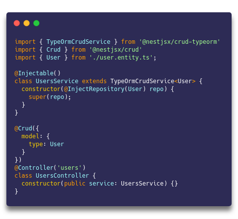

<div align="center">
  <h1>CRUD</h1>
</div>
<div align="center">
  <strong>for RESTful APIs built with NestJs</strong>
</div>

<br />

<div align="center">
  <a href="https://travis-ci.org/nestjsx/crud"></a>
  <a href="https://coveralls.io/github/nestjsx/crud?branch=master"></a>
  <a href="https://github.com/nestjsx/crud/blob/master/LICENSE"></a>
  <a href=""></a>
  <a href="https://www.npmjs.com/org/nestjsx">
  
  </a>
  <a href="https://npm.packagequality.com/#?package=@nestjsx%2Fcrud"></a>
  <a href="https://greenkeeper.io/"></a>
  <a href="http://makeapullrequest.com"></a>
  <a href="https://github.com/marmelab/awesome-rest#nodejs"></a>
  <a href="https://github.com/juliandavidmr/awesome-nestjs#components--libraries"></a>
  <a href="https://github.com/nestjs/nest"></a>
</div>

<div align="center">
  <sub>Built with :purple_heart: by
  <a href="https://twitter.com/MichaelYali">@MichaelYali</a> and
  <a href="https://github.com/nestjsx/crud/graphs/contributors">
    Contributors
  </a>
  <div align="center">
    :star2: :eyes: :zap: :boom:
  </div>
</div>

<br />

We believe that everyone who's working with NestJs and building some RESTful services and especially some CRUD functionality will find `@nestjsx/crud` microframework very useful.

## Features



- :electric_plug: Super easy to install and start using the full-featured controllers and services :point_right:

- :octopus: DB and service agnostic extendable CRUD controllers

- :mag_right: Reach query parsing with filtering, pagination, sorting, relations, nested relations, cache, etc.

- :telescope: Framework agnostic package with query builder for a frontend usage

- :space_invader: Query, path params and DTOs validation included

- :clapper: Overriding controller methods with ease

- :wrench: Tiny config (including globally)

- :gift: Additional helper decorators

- :pencil2: Swagger documentation

## Packages

- [**@nestjsx/crud**]() - core package which provides `@Crud()` decorator for endpoints generation, global configuration, validation, helper decorators ([docs]())
- [**@nestjsx/crud-typeorm**]() - TypeORM package which provides base `TypeOrmCrudService` with methods for CRUD database operations ([docs]())
- [**@nestjsx/crud-request**]() - request builder/parser package wich provides `RequestQueryBuilder` class for a frontend usage and `RequestQueryParser` that is being used internaly for handling and validating query/path params on a backend side ([docs]())

## Documentation

Use [Wiki]()

## Roadmap

- [x] Monorepository
- [x] TypeORM
- [ ] Mongoose
- [ ] Sequelize
- [ ] JSON API standard

## Support

Any support is wellcome.

### Contribution

Please open an [issue](https://github.com/nestjsx/crud/issues) or submit a [PR](https://github.com/nestjsx/crud/pulls) if you want to improve the functionality or help with testing edge cases.

### Sponsorship

<a href="https://opencollective.com/nestjsx/donate" target="_blank">
  
</a>

## Tests

```shell
docker-compose up -d
yarn bootstrap
yarn test
```

## License

[MIT](LICENSE)
